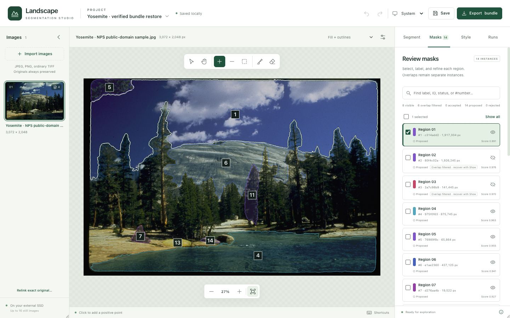
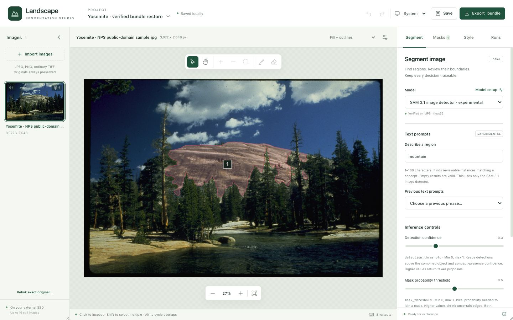
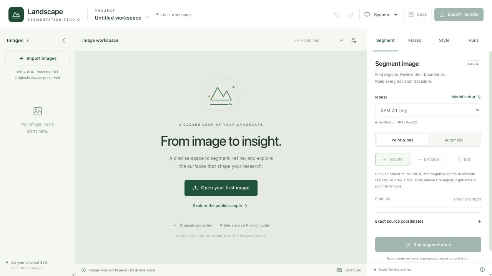
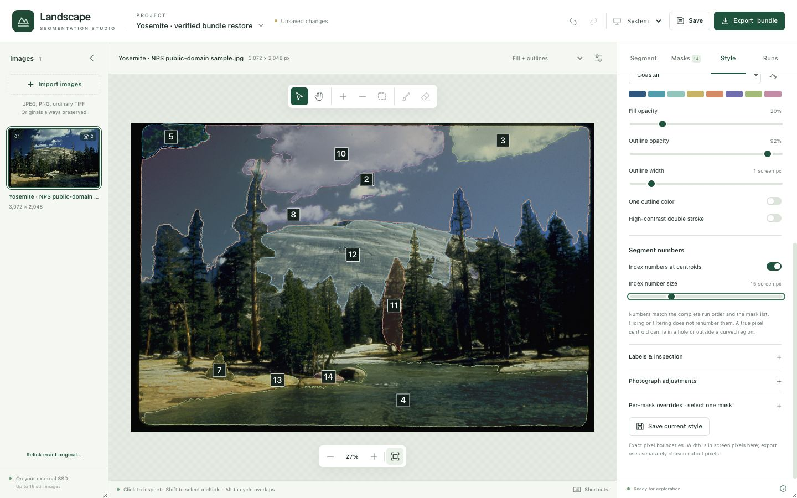
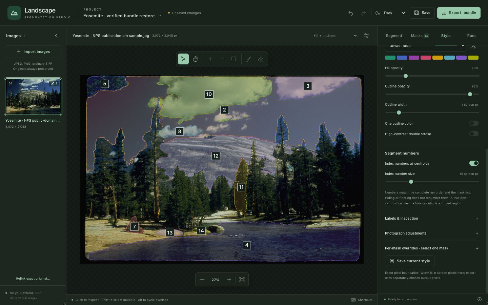
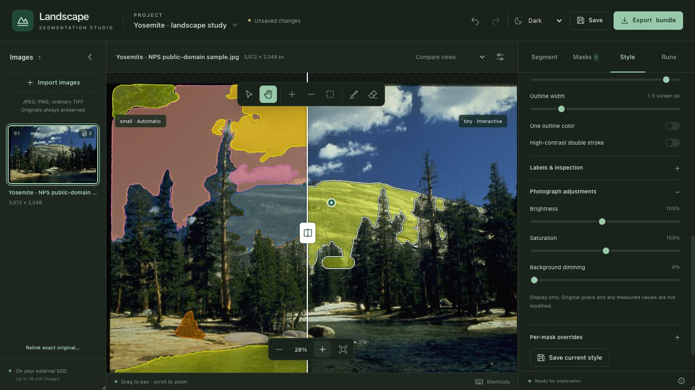
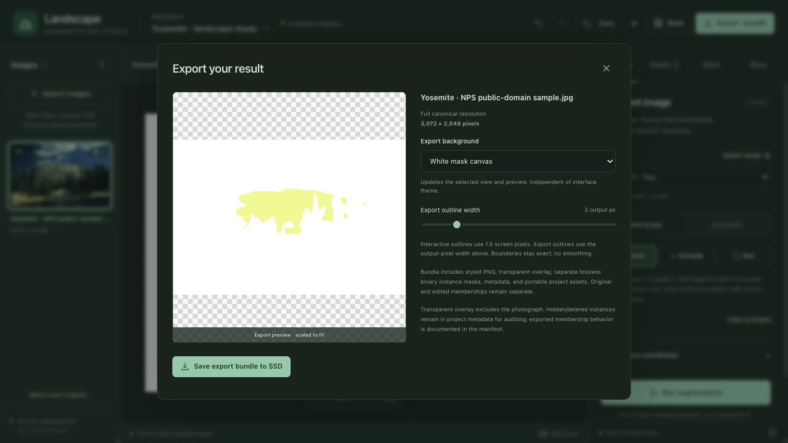

# Landscape Segmentation Studio

An independent educational application for exploring Meta's Segment Anything models on still images. Generate masks locally, review and correct them, compare model runs, style the results, and export images with traceable mask data.

**Your browser is the interface. Your own computer runs the models.** Normal use needs no cloud service, ChatGPT account, Codex installation, or internet connection after setup. Original images are preserved separately from model masks and manual corrections.



*Actual application capture using the attributed [Yosemite public sample](samples/ATTRIBUTION.md). Numbers identify masks in this run. These are model proposals, not validated land-cover classes.*

## Start here

| What you need | Where to start |
|---|---|
| Install and use the app on Windows | [Windows installation](#windows-installation) |
| Install on an Apple Silicon Mac | [Mac installation](#mac-installation) |
| You already have Python 3.13 or 3.14 | [Python versions](#python-versions) |
| Understand which models are downloaded | [Model setup](#model-setup) |
| Learn the image workflow | [First project](#your-first-project) |
| Build from GitHub source | [Source installation](#installing-from-source) |
| Publish or redistribute this project | [Publication guide](docs/PUBLISHING.md) and [license review](docs/LICENSING.md) |

**Download the named Mac or Windows setup ZIP from this repository's Releases section.** GitHub's green **Code → Download ZIP** and automatic **Source code (zip)** assets contain source only. They need an additional frontend build. The prepared platform ZIPs already contain that build.

This is a ZIP setup package, not a signed `.exe`, `.msi`, or `.app` installer. Python is currently a prerequisite. Setup installs dependencies into a dedicated local environment and downloads the two baseline checkpoints. You do not install Python packages one by one.

## Support status and requirements

| Component | Current status |
|---|---|
| Apple Silicon Mac | Real application and inference tested on Mac mini M4, 16 GiB memory, macOS 26.6.2 |
| Windows x64 Intel/AMD CPU | Setup and CPU path implemented; **native Windows execution not yet verified** |
| Windows x64 NVIDIA GPU | Optional CUDA 13 setup path; **native NVIDIA execution not yet verified** |
| Python | Standard native **CPython 3.12**; tested with 3.12.14 on M4 |
| Internet | Required for package/checkpoint downloads; normal inference is local and offline |
| Browser | Local browser interface; no account or extension required |
| Node.js | Not needed for prepared setup ZIPs; needed to build from source |
| Storage | Setup requires at least 12 GiB free on supported non-ExFAT drives, or 64 GiB on ExFAT; additional models/projects need more |

Disk-space checks are installation thresholds, not a guarantee that every dataset or model fits. ExFAT allocation can make small dependency files consume much more space than their download sizes. The SSD adds storage, not RAM. Start with Tiny or Small on unfamiliar hardware.

Mac setup requires a writable connected external drive. Windows requires a writable local NTFS/ExFAT drive; network shares are unsupported. Use a new dedicated folder. Windows ARM64, Intel Macs, Rosetta Python, PyPy, and free-threaded Python builds are unsupported. Older macOS versions and other Mac hardware have not been certified.

## Windows installation

Windows is a **test release**. Setup runs model compatibility checks, but native installation, persistence, and GPU validation remain pending. See [Windows validation limits](docs/WINDOWS_SETUP.md).

### 1. Extract the correct ZIP

Download `LandscapeSegmentationStudio-Windows-x64-0.2.1.zip`. Right-click it → **Extract All**, into a new dedicated location on a local drive. Do not run scripts inside the compressed ZIP. Keep this layout:

```text
LandscapeSegmentationStudio/
  app/
    START_HERE.md
    Setup Windows.cmd
    Setup Windows NVIDIA.cmd
    Start Studio.cmd
    Stop Studio.cmd
    README.md
    backend/
    frontend/
    scripts/
```

Keep `app` inside its own workspace: runtime, checkpoints, projects, and exports are created beside it. Do not extract over another installation or unrelated files.

### 2. Prepare Python 3.12 x64

Open Command Prompt and check:

```bat
py -3.12 --version
py -3.12 -c "import platform; print(platform.machine())"
```

Expect `Python 3.12.x` and `AMD64` or `x86_64`.

If missing, use the official [Python for Windows downloads](https://www.python.org/downloads/windows/). With Python's current install manager, `py install 3.12` installs a 3.12 runtime; then repeat the checks above. With the traditional 3.12 installer, choose 64-bit and include the Python launcher. Other Python versions can stay installed. See the official [Windows Python instructions](https://docs.python.org/3/using/windows.html) for manager/launcher conflicts rather than removing another project's Python setup.

### 3. Run one setup script

Open the extracted `app` folder:

| Computer | Double-click |
|---|---|
| CPU use, including Intel/AMD processors and computers without NVIDIA | `Setup Windows.cmd` |
| NVIDIA GPU with a CUDA 13 compatible installed driver | `Setup Windows NVIDIA.cmd` |

NVIDIA setup installs official pinned PyTorch CUDA wheels locally. It does not install a system GPU driver or CUDA toolkit. Intel/AMD integrated graphics use the CPU path; Intel GPU acceleration is not implemented. If unsure about GPU compatibility, start with CPU setup.

Keep internet connected and the terminal window open. Setup:

1. Checks Python, drive identity, free storage, and file operations.
2. Creates `runtime/venv/` and installs pinned dependencies there.
3. Downloads SAM 2.1 Tiny and Small from the official publisher, verifying sizes and SHA256 hashes.
4. Runs genuine local model tests, one at a time.
5. Reports success or displays the error and the relevant local log.

The two baseline checkpoints total about 325 MiB plus small configuration files. Packages add further downloads. Time depends on the connection and hardware. **You do not download these baseline checkpoints manually or sign into Hugging Face for them.**

### 4. Start, save, and stop

After success, double-click **Start Studio.cmd**. Your browser opens [http://127.0.0.1:8765/](http://127.0.0.1:8765/), which points to your own computer.

For later sessions, use **Start Studio.cmd** directly. Save with **Ctrl+S**, wait for **Saved locally**, and use **Stop Studio.cmd** when finished. Closing the browser does not stop Python. Do not repeat setup each session.

## Mac installation

### 1. Extract onto the external drive

Download `LandscapeSegmentationStudio-Mac-Apple-Silicon-0.2.1.zip`. Double-click it to extract into a **new dedicated folder on a connected external drive**. Keep `LandscapeSegmentationStudio/app/`. An existing working installation does not need to be reinstalled to use this guide.

### 2. Prepare native Python 3.12

In Terminal:

```sh
python3.12 --version
python3.12 -c "import platform; print(platform.machine())"
```

Expect `Python 3.12.x` and `arm64`. Install a native 3.12 runtime from a trusted source if missing; [Python's macOS documentation](https://docs.python.org/3/using/mac.html) explains official options. Other Python versions can stay installed. Studio does not install system Python, use administrator privileges, or edit shell startup files.

### 3. Set up once, then launch

In `app`, double-click **Setup Mac.command**. It installs project-local dependencies, downloads Tiny/Small, and runs real local model checks. Leave the drive connected and internet available until setup finishes.

Then double-click **Start Studio.command**. Save with **⌘S**, and use **Stop Studio.command** before ejecting the drive. If a source download did not preserve launcher permissions, open Terminal in `app` and run:

```sh
zsh 'Setup Mac.command'
zsh 'Start Studio.command'
```

The prepared Mac ZIP preserves executable permissions. See [MAC_SETUP.md](docs/MAC_SETUP.md) for drive, ExFAT, and recovery details.

## Python versions

**This release accepts Python 3.12, not an unrestricted “3.12 or newer.”** Python 3.13/3.14 looks feasible: metadata checks found wheel candidates for all 49 pins on Mac ARM64 and Windows x64. Application execution under those interpreters has not been tested. `torchvision==0.27.1` explicitly excludes **Python 3.14.1**.

Keep your newer Python and install 3.12 alongside it. Launchers use the project's own environment; other projects can continue using their versions. Removing the version check does not establish compatibility. [Full Python review](docs/PYTHON_COMPATIBILITY.md).

## Model setup

**`sam_vit_h_4b8939.pth` is original SAM 1 ViT-H, even if stored in a folder named SAM2.** This app supports that original SAM checkpoint; SAM 1 ViT-B/ViT-L adapters are not offered.

| Model family | Available sizes | How obtained | Workflow |
|---|---|---|---|
| SAM 2.1 | Tiny, Small, Base-Plus, Large | Tiny/Small during setup; others optional | Points, negative points, boxes, automatic masks |
| SAM 2 | Tiny, Small, Base-Plus, Large | Optional official download | Points, negative points, boxes, automatic masks |
| SAM 1 | ViT-H / Huge | User-supplied official checkpoint and local conversion | Points, negative points, boxes, automatic masks |
| SAM 3.1 | Multiplex checkpoint's image detector | Recipient obtains access and required files; local conversion | **Experimental text segmentation only** |

Original SAM 3 is not a separate working model entry. The text adapter targets **SAM 3.1**. It is unofficial, and numerical parity with Meta's CUDA implementation has not been established.

### Download all eight SAM 2 / SAM 2.1 checkpoints

After baseline setup, run these **from inside `app`**. No environment activation is needed.

Windows Command Prompt:

```bat
..\runtime\venv\Scripts\python.exe -B scripts\download_models.py --model all
..\runtime\venv\Scripts\python.exe -B scripts\verify_models.py --model all
```

Mac Terminal:

```sh
../runtime/venv/bin/python -B scripts/download_models.py --model all
../runtime/venv/bin/python -B scripts/verify_models.py --model all
```

All eight snapshots total about 2.91 GiB; existing verified files are reused. Replace `all` with one ID if wanted: `tiny`, `small`, `sam2.1-base-plus`, `sam2.1-large`, `sam2-tiny`, `sam2-small`, `sam2-base-plus`, or `sam2-large`. Verification with `all` also checks any registered local SAM1/SAM3.1 conversions.

Restart Studio after adding models. A model becomes enabled only after installation and its device-specific tests pass. **Model setup** displays status and provides **Unload model from memory**. Only one model is loaded at a time; large models can still exceed available RAM/VRAM.

### Optional SAM 1 ViT-H

Obtain `sam_vit_h_4b8939.pth` from the [official SAM repository](https://github.com/facebookresearch/segment-anything#model-checkpoints). Put it in `LandscapeSegmentationStudio/SAM1/`, beside `app`. From `app`:

Windows:

```bat
..\runtime\venv\Scripts\python.exe -B scripts\convert_local_checkpoints.py --model sam1-h
..\runtime\venv\Scripts\python.exe -B scripts\verify_models.py --model sam1-h
```

Mac:

```sh
../runtime/venv/bin/python -B scripts/convert_local_checkpoints.py --model sam1-h
../runtime/venv/bin/python -B scripts/verify_models.py --model sam1-h
```

Conversion preserves the source and refuses to overwrite an existing converted directory. [Checkpoint hashes](docs/MODEL_COMPATIBILITY.md).

### Optional SAM 3.1

Read the [SAM License review](docs/LICENSING.md). Each recipient obtains access through the [official SAM3.1 publisher page](https://huggingface.co/facebook/sam3.1). No tokens, access approval, or original/converted weights are bundled with Studio.

Follow [SAM3_ACCESS.md](docs/SAM3_ACCESS.md) for the checkpoint **and configuration/tokenizer files**, placement, conversion, and local testing. The `.pt` file alone is insufficient. An example text result appears below; empty results are valid too.



## Your first project

### 1. Import a still image



Click **Open your first image**, **Import images**, or drag an image into the app. Choose **Explore the public sample** for the attributed example. The project-name menu opens, creates, renames, and restores projects. Demo project names in screenshots are development examples, not private projects included in the download.

JPEG, PNG, and ordinary single-page 8-bit RGB/grayscale TIFF are supported. Imports are limited to 24 megapixels and 100 MiB per file, with up to 16 still images per project. **Automatic/text segmentation has a separate 8-megapixel limit.** Scientific/multiband/radiometric TIFF, animation, video, camera input, and training are excluded.

Original bytes are copied intact and hashed. Prompts and masks use a separate full-resolution, orientation-corrected image grid. The selected photograph is not overwritten.

### 2. Make a segmentation run

For a first automatic run: **Segment → SAM 2.1 Small → Automatic → Fast preview → Generate masks**. Tiny is also a useful baseline. Inspect the result before increasing the workload.

For a chosen object: **Point & box → Include**, click inside it, add **Exclude** points on unwanted areas, or drag a **Box**, then **Run segmentation**. Drag markers to adjust them; right-click a point to remove it. Prompts affect the next run, not previous results.

For text: select verified **SAM 3.1 image detector · experimental**, enter a concept such as `mountain`, then **Run text segmentation**. This detector does not expose point/box refinement.

### 3. Adjust inference controls

Controls show supported ranges and descriptions. Settings require an explicit **new run**. Change one thing at a time and compare outcomes in **Runs**.

| Parameter | Range | Meaning |
|---|---|---|
| `points_per_side` | 2–32 | Square grid: 8 means 64 locations; 24 means 576. More locations take more work. |
| `points_per_batch` | 1–16 | Concurrent prompt groups; effective batch may be reduced for memory. |
| `pred_iou_thresh` | 0–1 | Higher rejects more masks based on predicted quality, not measured accuracy. |
| `stability_score_thresh` | 0–1 | Higher rejects masks that change more under shifted pixel cutoffs. |
| `box_nms_thresh` | 0–1 | Higher retains more overlapping bounding boxes during generation. |
| `crop_n_layers` | 0 only | Disabled; crop-pyramid generation is not verified. |
| `overlap_threshold` | 0–100% | Optional exact-mask overlap suppression after generation. |
| SAM3.1 `detection_threshold` | 0–1 | Higher retains fewer detections. |
| SAM3.1 `mask_threshold` | 0–1 | Higher requires greater pixel confidence for mask membership. |

Minimum-region, hole, and sprinkle cleanup are not adjustable processing. Disabled settings are not silently applied. Dense grids increase computation substantially; output memory and PyTorch safeguards remain bounded.

### 4. Reduce overlapping proposals if wanted

Before automatic processing, expand **Advanced inference controls** and enable **Remove overlapping masks**:

- **Smaller-mask coverage** divides shared pixels by the smaller mask's area. A small mask inside a large one has 100% coverage.
- **IoU** divides shared pixels by their union. The same nested pair can have low IoU.

At 80%, qualifying overlap hides the lower-scoring proposal. Lower percentages filter more aggressively. At zero some shared pixels are still required; at 100% complete overlap is required for the chosen metric. Equal scores preserve proposal order.

**Whole proposals are hidden; pixels are not cut out.** **Masks → Show / Show all** recovers them. All membership and suppression metadata remain in the project. Bounding-box NMS is an earlier, separate step; this filter cannot restore candidates already discarded by NMS.

### 5. Review and correct masks

Select a row in **Masks** or click its region. Rename its surface label, accept/reject it, hide it, or select one mask and use brush/eraser corrections. Original model masks stay separate from edited derivatives. Merge creates a manual union with source references.

Shift-click selects multiple regions; Alt/Option-click cycles overlapping masks. Undo/redo covers recent in-memory actions. **Accept/Reject records review status; it does not automatically change visibility or export inclusion.** Hide a mask to omit its individual PNG/CSV entry.

### 6. Style and number segments

**Style** offers original, outlines, fills, fill + outlines, mask-only canvas, spotlight, categories, and comparison. Choose among ten palettes, adjust opacity/boundaries, and enable **Index numbers at centroids**.

Numbers match the mask list and CSV and stay stable when masks are hidden. A true centroid may fall in a hole or outside a curved region. Screen/export sizes are separate. Palettes, themes, labels, and opacity change visualization without rerunning a model or changing membership.





### 7. Compare, save, and export

In **Runs**, open a result or select another for comparison. A shared pan/zoom and draggable divider reveal differences. Comparison does not prove which model is more accurate without reference annotations.



Click **Save** or Ctrl+S / ⌘S and confirm **Saved locally**. A reload requires reopening the project through its name menu. Keep the drive connected during writes and inference.

Choose **Export bundle**, select the background, output-pixel outline width, and optional centroid numbers, then **Save export bundle to SSD**. The ZIP contains styled PNG, transparent overlay, visible individual binary masks, original masks, CSV, JSON provenance, and portable project/source assets. Exports preserve canonical dimensions. **A project export can contain your original images; share it only intentionally.**



**Project menu → Restore bundle** restores an exported ZIP as a new project, preserving the existing one. Earlier comparison/export screenshots show these workflows before the latest label controls; no screenshot depicts a tested Windows installation. [Full user guide](docs/USER_GUIDE.md) · [Export formats](docs/EXPORT_FORMATS.md).

## Where your files live

```text
LandscapeSegmentationStudio/
  app/             source, built interface, launchers, documentation
  runtime/         local Python environment and package caches
  model-cache/     downloaded and converted models
  projects/        image copies, masks, edits, project revisions
  exports/         user-created export ZIPs
  setup-notes/     local drive identity and compatibility reports
  tmp/             project-local temporary files
  SAM1/            optional original SAM checkpoint
  SAM3.1/          optional authorized SAM3.1 files
```

Do not share `runtime/venv` as an installer or another machine's reports as proof your device works. Setup creates new evidence locally. Do not edit drive identity files to silence mismatches. Use a new installation and restore projects deliberately. [Storage contract](docs/STORAGE_CONTRACT.md) · [Image recovery](docs/IMAGE_RECOVERY.md).

## Troubleshooting

| Symptom | Next step |
|---|---|
| `py` / `python3.12` missing | Complete the Python steps and check version/architecture. Other versions can remain installed. |
| Built interface missing | Use a platform ZIP from Releases or build the source frontend below. |
| Model greyed out | Check Model setup; download/convert its files, run verification, and restart Studio. |
| Baseline test fails/times out | Read `setup-notes/verify-tiny.log` or `verify-small.log`. Tests are bounded to 180 seconds each; a slow CPU can exceed this. Do not mark a failed check passed. |
| Local browser address unavailable | Run Start Studio and read its terminal error. Keep the selected drive connected. |
| Port 8765 occupied | Use this workspace's Stop script if it owns that process; otherwise resolve the other application normally. Studio does not kill unrelated processes. |
| Memory error | Use a smaller model, fewer grid points, or fewer prompts per batch. Disk capacity does not increase RAM/VRAM. |
| No text masks | Empty results are valid. Try a concise concept and review confidence in a new run. |
| Save fails/drive disconnects | Keep unsaved state open, reconnect the same drive, and retry when available. |
| Original copy missing | Use **Relink exact original** with the identical original file. Matching filenames alone are insufficient. |

For an issue report, include OS, architecture, Python version, model ID, and error text. Redact private paths and image details. Do not attach checkpoints, access tokens, or private project bundles.

## Installing from source

Create a dedicated outer workspace, on the supported external drive for Mac. Clone/extract this repository **as its `app/` child**. Ensure `app/README.md` exists, not `app/landscape-segmentation-studio-main/README.md`.

Source Git deliberately ignores `frontend/dist/`. Install Node.js 24 and npm for development, then open a terminal in `app/frontend`:

```sh
npm ci --no-bin-links --ignore-scripts --cache ../../runtime/npm-cache
npm run build
```

Return to `app` and follow your OS setup instructions. Build the frontend before Python setup downloads dependencies and checkpoints. Normal launch serves the built interface and needs no Vite development server.

After setup, from `app`, use the project Python to run `-m pytest -q`. From `app/frontend`, run `node --test tests/masks.test.mjs` and `npm run build`. Real model checks use `scripts/verify_models.py`; a frontend build or tensor probe is not a model test.

The M4 baseline passed **125 Python tests plus 41 subtests, 14 frontend tests**, nine point/box/automatic adapters, experimental SAM3.1 text inference, offline checks, and export/restore verification. Later package checks are in [VALIDATION.md](docs/VALIDATION.md). These results do not certify Windows, model accuracy, or untested Python versions.

## Licenses and educational use

Original application code uses **Apache License 2.0**: [LICENSE](LICENSE), [NOTICE](NOTICE). Third-party materials retain their terms. No copyright is claimed in the original U.S. Government photograph. This independent project is not endorsed by Meta, Hugging Face, or the National Park Service.

| Material | License |
|---|---|
| Original Studio application and documentation | Apache-2.0, with third-party exclusions |
| SAM 1 and SAM 2 / SAM 2.1 | Apache-2.0 from Meta |
| SAM 3 / SAM 3.1 materials and derivatives | **Custom SAM License**, not Apache-2.0 |
| Retained Hugging Face conversion functions | Apache-2.0, upstream notices preserved |
| Bundled React, React DOM, Scheduler and Vite helper | Preserved MIT notices |
| Other dependencies and images | Their own licenses/rights |

Publish source and reviewed setup packages while keeping checkpoints, environments, credentials, and personal projects out of GitHub. Distributed SAM3 materials/derivatives must remain under Meta's agreement with a copy of it. SAM3 research publications must acknowledge its use. Education is not an exemption from license, privacy, copyright, or trade-control requirements.

The [license review](docs/LICENSING.md) documents SAM3 restrictions and the unresolved interpretation of its broad reverse-engineering clause for the experimental conversion. This is not a finding that the integration is prohibited, nor definitive legal clearance. Obtain written Meta clarification or qualified legal advice if you require definitive clearance of that integration before publication. Keep original/converted weights local.

See [third-party notices](THIRD_PARTY_NOTICES.md), [license copies](licenses/README.md), [sample attribution](samples/ATTRIBUTION.md), and [exact upload instructions](docs/PUBLISHING.md).

Please acknowledge the models used: [Segment Anything](https://arxiv.org/abs/2304.02643), [SAM 2](https://arxiv.org/abs/2408.00714), [SAM 3](https://arxiv.org/abs/2511.16719). Identify SAM3.1 specifically when using that checkpoint. Saved run metadata records model identity and settings.

## Scope and next improvements

This release explores still-image segmentation. It does not provide calibrated land-cover accuracy, ground truth, square-metre measurements, temperature extraction, thermal analysis, video tracking, training, or a cloud service.

Useful next steps are a verified project-local Python bootstrap, a simple model setup/download wizard, native Windows CPU/NVIDIA testing, and separate Python 3.13/3.14 validation. These are proposed improvements, not current features. A self-contained installer also needs runtime notices and native installation testing.
